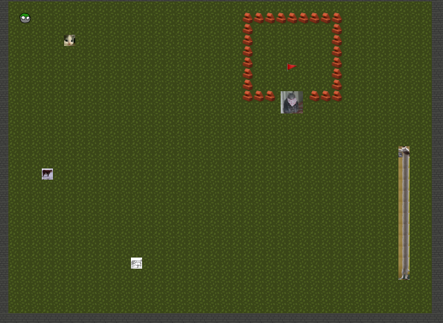

# [Magiczna cat](https://hack.cert.pl/challenge/magiczna-cat)

## Task

We are given a really fun browser game.



## Solution

The game is written in Haxe and compiled to JS, which doesn't really matter as we can read the code fairly easily.

The only interesting lines of code are:

```js
var Main_checks = ["05d9b7c7ab57d1910d371165311b8690c89fd001a9e6f9278fe1ed8dd56f0788", /* ... */];

// ...


                while(idx < checks.length) {
                    var c = checks[idx];
                    ++idx;
                    var code = evt.keyCode;
                    var key_combination_hash = haxe_crypto_Sha256.encode(current_combination + String.fromCodePoint(code));
                    if(key_combination_hash == c) {
                        var code1 = evt.keyCode;
                        current_combination += String.fromCodePoint(code1);
                        ok = true;
                    }
                }
                if(!ok) {
                    current_combination = "";
                } else if(Main_checks.length == current_combination.length) {
                    this.chonker.dead = true;
                    this.chonker.text.set_text("What did you just call me?");
                    motion_Actuate.tween(this.chonker.sprite,5,{ alpha : 0}).delay(1);
                    motion_Actuate.tween(this.chonker.text,5,{ alpha : 0}).delay(1);
                    this.chonker.interact();
                    var key = haxe_io_Bytes.ofString(current_combination);
                    var msg = haxe_io_Bytes.ofHex(Main_puma);
                    var totallyNotRc4 = new haxe_crypto_RC4();
                    totallyNotRc4.init(key);
                    var data = totallyNotRc4.encrypt(msg).toString();
                    this.flag.text.set_text(data);
                }
```

Here, the game checks for a key combination and recursively compares the keys with encoded hashes.

We can quickly brute force this key combination ([solve.py](./solve.py)): `SPEAKCHONKERANDENTER`

And after typing it in the game we receive the flag: `ecsc24{A_cat_from_my_past_btw_the_language_is_called_haxe}`