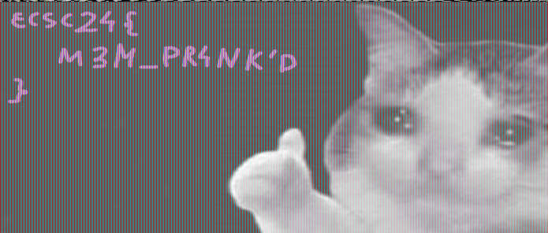

# [Office Retribution](https://hack.cert.pl/challenge/office-retribution)

## Task

We are given a RAM dump of a Windows PC.

## Solution

Exploring the dump using volatility.

`python3 ../volatility3/vol.py -f ../office-retribution.raw windows.cmdline`

Show us

```
...
"C:\Windows\system32\mspaint.exe" "C:\Users\Arnold\Desktop\cat.png"
...
```

a really interesting file!

But when scanning for files

`python3 ../volatility3/vol.py -f ../office-retribution.raw windows.filescan | grep cat.png`

Unfortunately cat.png is not present there.


Though, we can dump the `mspaint.exe` process memory, and try to retreive the image from there.

`python2 ../volatility/vol.py -f ../office-retribution.raw --profile=Win7SP1x86_23418 memdump -p 3904 -D memdump`

Now, we need to rename the file to `mspaint.data`, open it in GIMP, and experiment with image dimensions.



`ecsc24{M3M_PR4NK'D}`