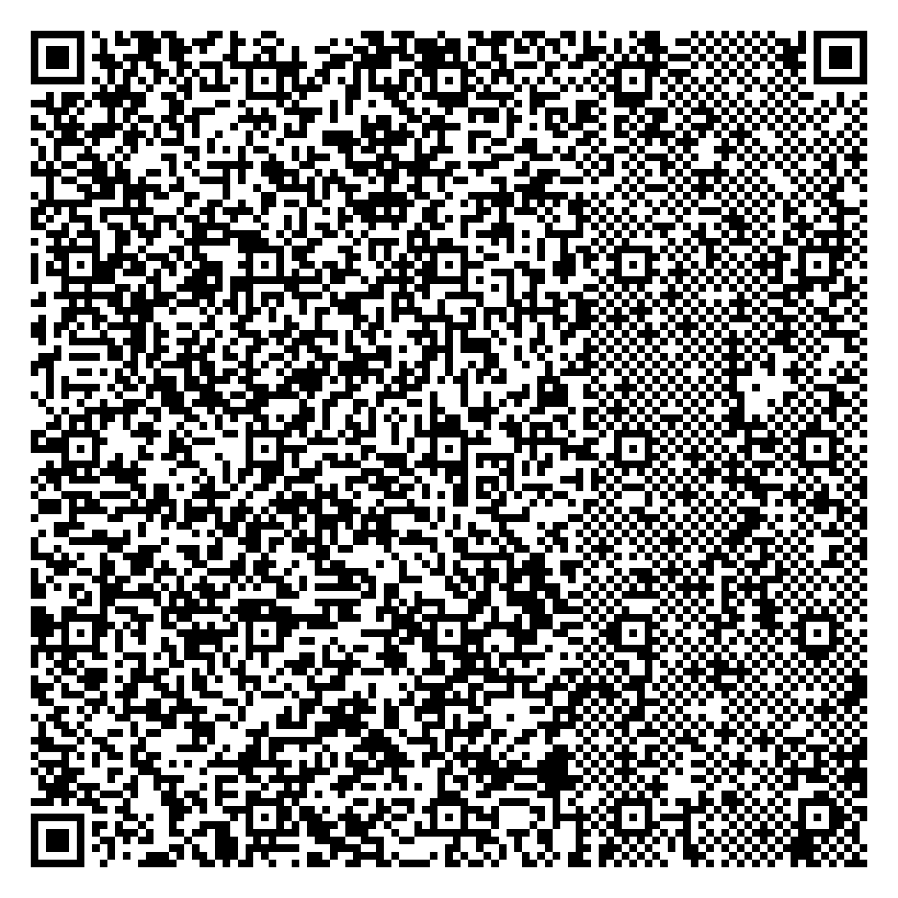

# [QuiRks](https://hack.cert.pl/challenge/quirks)

## Task

We get a suspiciously weird QR code image.



## Solution

I first cropped and resized the image using paint.net to easily load it in python, and then convert to text.

```py
from PIL import Image
import numpy as np

img = Image.open('quirks.png')

pixels = np.array(img).astype(str)

pixels[pixels == '0'] = 'X'
pixels[pixels == '1'] = '_'

s = '\n'.join(''.join(row) for row in pixels)

with open('qr.txt', 'w+') as f:
    f.write(s)
```


I used https://github.com/waidotto/strong-qr-decoder to debug the QR code, but the messages were all in japanese, so at first I had to translate them, which took some time :)

After running

`python2 qr.py qr.txt --verbose`

on the modified decoder script, I found out that this QR code consists of

- Blocks which had fake flags and bait messages

- Multiple 0-length blocks of alternating types - alphanumeric and bytes

Those 0-length blocks looked very much like binary code. 
I then decoded the flag by modifying only few lines in the script:

```py
flag = ''

...

while len(data_bits) != 0:
    ...
    # alphanumeric
    if mode == 0b0010:
        ...

        if length == 0:
            flag += '0'

    # 8-bit byte
    if mode == 0b0100:
        ...

        if length == 0:
            flag += '1'

...

print('FLAG:')
print(flag)

def bitstring_to_bytes(s):
    v = int(s, 2)
    b = bytearray()
    while v:
        b.append(v & 0xff)
        v >>= 8
    return bytes(b[::-1])

print(bitstring_to_bytes(flag))
```

[qr.py](./qr.py)

`ecsc24{5t3g4n0_g0d}`