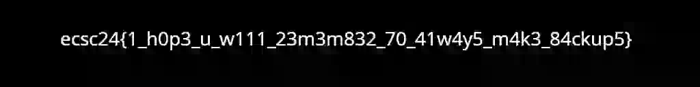

# [The zettabyte file search](https://hack.cert.pl/challenge/zettabyte)

## Task

We get a ZFS filesystem dump or something, and we need to extract a picture with the flag.

> Hint (29.06.24 16:00): Sometimes having a monkey brain is the way forward.

## Solution

Using our monkey brain we can search for the flag:

```
cat zettabyte.raw | grep -i flag
```

And we see `flag.webp` there

The WebP header is `RIFF????WEBP` which usefully has the file size in the 4 bytes between `RIFF` and `WEBP`

So we `grep` the memory dump and output the byte offset:

```
grep -a -b -o 'RIFF' zettabyte.raw > webp-files.txt
```

And extract the images using [this script](./solve.py)

This took some time because there were many raccoons🦝 inside, but finally the flag popped up.




`ecsc24{1_h0p3_u_w111_23m3m832_70_41w4y5_m4k3_84ckup5}`